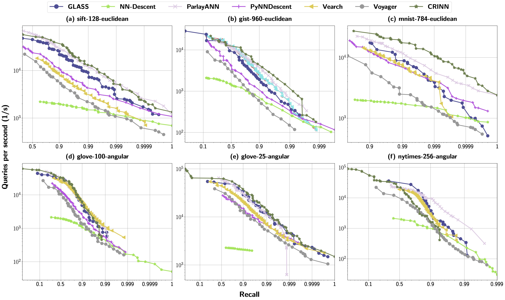

<div align="center">
  <picture>
      
  </picture>
</div>

<hr>
<p align="center">
<a href="https://github.com/deepreinforce-ai/CRINN/blob/main/LICENSE"></a> &nbsp;&nbsp;&nbsp; | &nbsp;&nbsp;&nbsp; <b>📄&nbsp;&nbsp;<a href="">Paper</a></b>
</p>

# CRINN: Contrastive Reinforcement Learning for  Approximate Nearest Neighbor Search


## Introduction

This repo contains the code for **CRINN**, a reinforcement learning-augmented LLM framework for automated optimization of approximate nearest-neighbor search (ANNS) algorithms. CRINN achieves **best-in-class performance** on three out of six widely-used NNS benchmark datasets (GIST-960-Euclidean, MNIST-784-Euclidean, and GloVe-25-angular) and tied for first place on two (SIFT-128-Euclidean and GloVe-25-angular). The current version uses [GLASS](https://github.com/zilliztech/pyglass) as the starting point for RL training.

<div align="center">
  <picture>
      
  </picture>
<br>
</div>

## 🥳 News 

**Stay tuned!**
* **[3 Aug, 2025]** The repository is created and we release the first version. 


### To-do List
- [ ] Add RL version based on ParlayANN
- [ ] Incorporate both Euclidean and angular distances as RL training rewards

## Key Optimization Discoveries

- **Adaptive Search Scaling**: Dynamic ef parameter adjustment based on recall requirements
- **Multi-Level Prefetching**: Intelligent prefetching considering neighbor density and search layer
- **Multi-Entry Point Architecture**: Parallel exploration from diverse entry points
- **Convergence Detection**: Smart early termination to avoid unnecessary exploration

## Usage

### Installation from Source

``` bash
sudo apt-get update && sudo apt-get install -y build-essential git python3 python3-distutils python3-venv
pip3 install numpy
pip3 install pybind11
bash build.sh
```


### Quick Start

```bash
python examples/main.py
```


## Citation

## Acknowledgement
- [GLASS](https://github.com/zilliztech/pyglass)
- [ParlayANN](https://github.com/cmuparlay/ParlayANN)
- [ann-benchmarks](https://github.com/erikbern/ann-benchmarks)


## Contact

Feel free to raise github issues or directly reach out to us at **research@deep-reinforce.com**.
